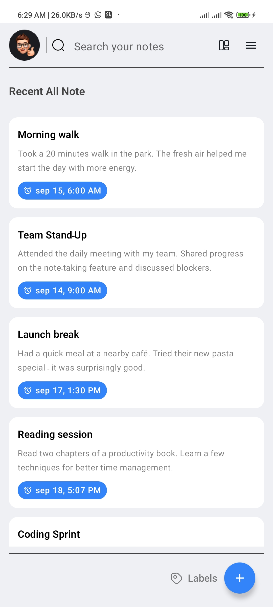
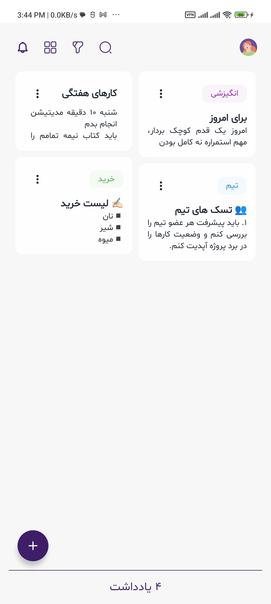
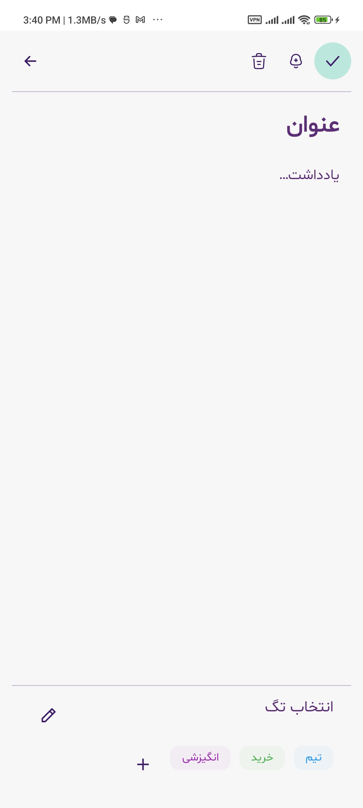
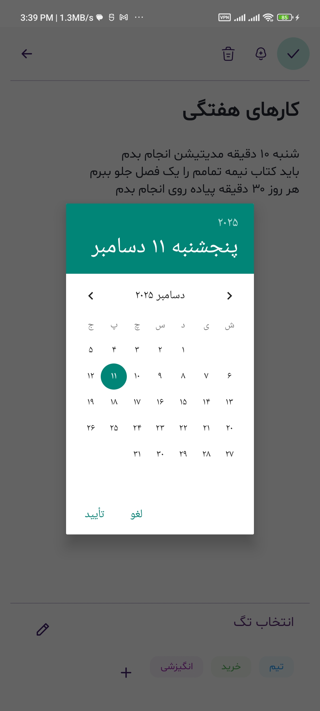
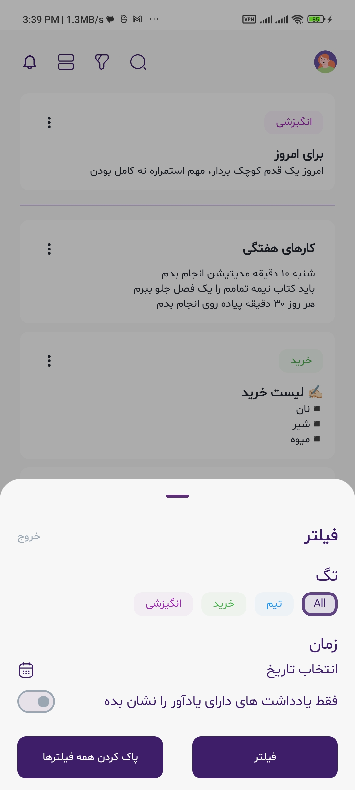

# 📒 NoteApp

An Android application for managing notes with support for search, pinning, and detail editing.  
Built using **Clean Architecture**, **MVVM**, **Jetpack Compose**, and **Hilt** to ensure scalability, maintainability, and testability.


 |  | 
|:---:|:---:|
|Home Page(List layout)| Home Page(Grid layout) | 

 |  | 
|:---:|:---:|:---:|
|Note Details | Set notification | Filter|


---

## 🚀 Features

- Create, update, and delete notes  
- Pin/unpin notes (only one note pinned at a time)  
- Real-time search across titles and descriptions  
- Grid/List layout toggle
- Persistent storage using Room  
- Reactive state with Kotlin Flows  
- Unit tests and UI tests

---

## 🏛️ Architecture

The app follows **Clean Architecture** with layered separation of concerns and **MVVM (Model-View-ViewModel)** at the presentation layer.

```
app/
 ├── core/                 # Core (constants, enums, extensions, ...)
 │    ├── constants/ 
 │    ├── enums/ 
 │    ├── extensions/
 │
 ├── data/                 # Data sources & Room database
 │    ├── local/            # Room DAOs and DB entities
 │    ├── repository/      # Repository implementations
 │
 ├── domain/               # Business logic layer
 │    ├── model/           # Core domain models (Note, etc.)
 │    ├── repository/      # Repository interfaces
 │    ├── usecase/         # Use cases (AddNote, DeleteNote, etc.)
 │
 ├── presentation/         # UI & state management
 │    ├── home/            # Home screen (list, search, selection)
 │    ├── detail/          # Note detail/edit screen
 │    ├── components/      # Reusable Compose UI components
 │    ├── theme/           # Colors, Typography, Shapes
 │
 ├── di/                   # Hilt dependency injection modules
```

## 🛠️ Tech Stack

- **Language**: Kotlin  
- **UI**: Jetpack Compose (Material3, State, Navigation)  
- **DI**: Hilt  
- **Database**: Room  
- **Async**: Kotlin Coroutines + Flow  
- **Architecture**: Clean Architecture + MVVM  
- **Testing**:
  - JUnit4
  - Turbine (Flow testing)
  - Coroutines Test
  - MockK / Fake repositories
  - Compose UI testing  

---

